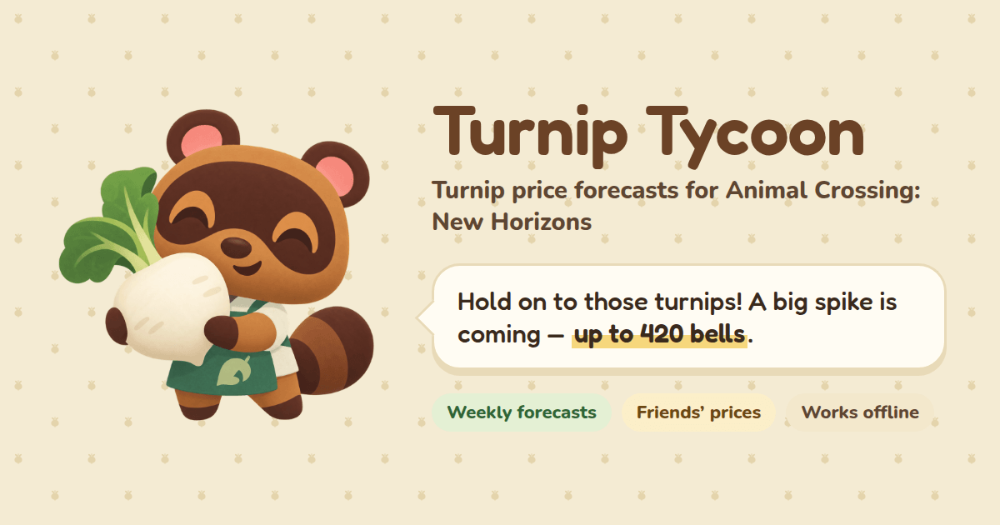
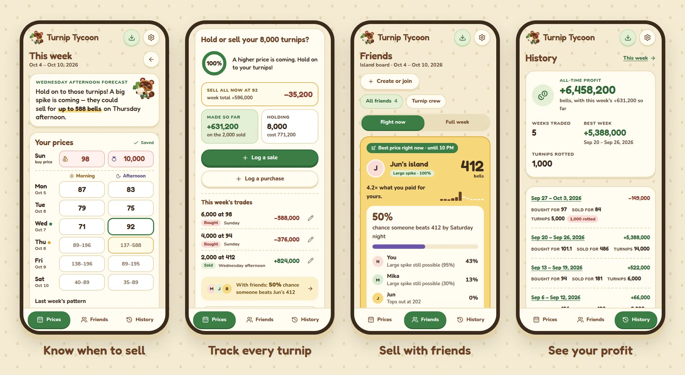

  

  

Free · No sign-up · Works offline

---

 

Bought turnips from Daisy Mae? Enter the prices Nook's Cranny offers, and Turnip Tycoon tells you where your week is heading and when to sell, before your turnips spoil.

  

## What you can do

- **See what's coming.** Get your week's likely pattern, a price range for every half-day, and the chance of a better price before Saturday.
- **Track your turnips.** Log what you buy and sell, at whatever price, and see what you made each week and all time.
- **Sell with friends.** Start a group of up to eight islands and see who has the best price right now. Friends see your prices, never your profit.
- **Take it anywhere.** Install it on your phone, keep going offline, and carry on from your computer.

## Help translate

New languages start as machine drafts and need players who speak them to check the wording.

| Language   | Status             |
| ---------- | ------------------ |
| English    | 🟢 Reviewed        |
| Deutsch    | 🟠 In review       |
| Español    | 🟠 Needs reviewers |
| Français   | 🟠 Needs reviewers |
| Italiano   | 🟠 Needs reviewers |
| Nederlands | 🟠 Needs reviewers |
| Русский    | 🟠 Needs reviewers |
| 日本語     | 🟠 Needs reviewers |
| 한국어     | 🟠 Needs reviewers |
| 简体中文   | 🟠 Needs reviewers |
| 繁體中文   | 🟠 Needs reviewers |

Spot something off? Fix it in [`src/client/locales`](src/client/locales) and open a pull request, right on GitHub if you like. [Contributing](CONTRIBUTING.md#translations) explains the format and the game's terms. Missing a language you play in? [Open an issue](https://github.com/Rakantor/turnip-tycoon/issues).

 

---

 

  <a href="CONTRIBUTING.md">Contributing &amp; development</a>
   
   
  Inspired by <a href="https://turnipprophet.io">Turnip Prophet</a>.
   
  A fan project, not affiliated with Nintendo.

